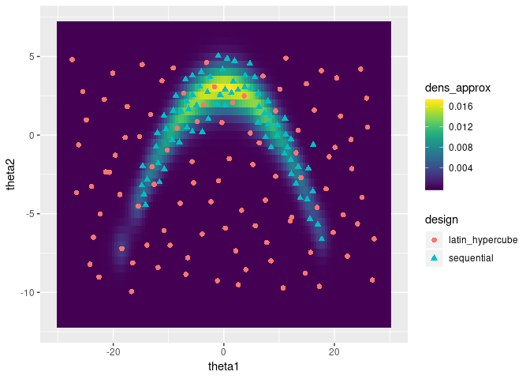

# doit: Design of experiments-based interpolation technique

This R package implements the design of experiments-based interpolation
technique (DoIt, Joseph 2012) for approximate Bayesian computations. 

The method uses evaluations of the unnormalised posterior density at a
space-filling design of parameter values. Normalisation of the posterior is
achieved by approximating the target density by a weighted sum of Gaussian
kernels centered on the design points. 

DoIt approximates the joint posterior, marginal posteriors densities, posterior
expecations and posterior variances. The package contains functions to
optimally choose additional design points, and to calculate the optimal kernel
with by cross validation.

<center>

</center>

_Figure: DoIt approximation of a complicated 2-dimensional posterior in 2 waves. Plot taken from the vignette `doit-2d`._

**References**:

- **Bayesian Computation Using Design of Experiments-Based Interpolation
  Technique**, Joseph, 2012, Technometrics,
[10.1080/00401706.2012.680399](http://dx.doi.org/10.1080/00401706.2012.680399)
- **A Note on Nonnegative DoIt Approximation**, Joseph, 2012, Technometrics,
  [10.1080/00401706.2012.759154](http://dx.doi.org/10.1080/00401706.2012.759154)


## Installation

```r
devtools::install_github('sieste/doit-method', build_vignettes=TRUE)
library(doit)
```


## Vignettes

```r
vignette('doit-1d') # 1d example from the Joseph (2012) paper
vignette('doit-2d') # 2d example from the Joseph (2012) paper
```


## Todo

- test that `doit_marginal()` behaves as expected with different settings for
  `theta_eval`
- add @seealso tags
- add links to roxygen blocks (had/r-pkgs/man)
- add example data
- add argument `near` to specify starting point in `doit_propose_new`
- make `GGfun` more efficient by accounting for symmetry
- in `doit_fit` and `doit_update` check for duplicate design points
- improve efficiency of `doit_estimate_w`


