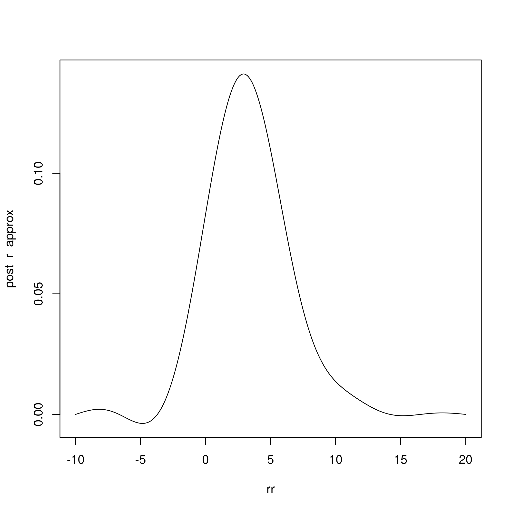
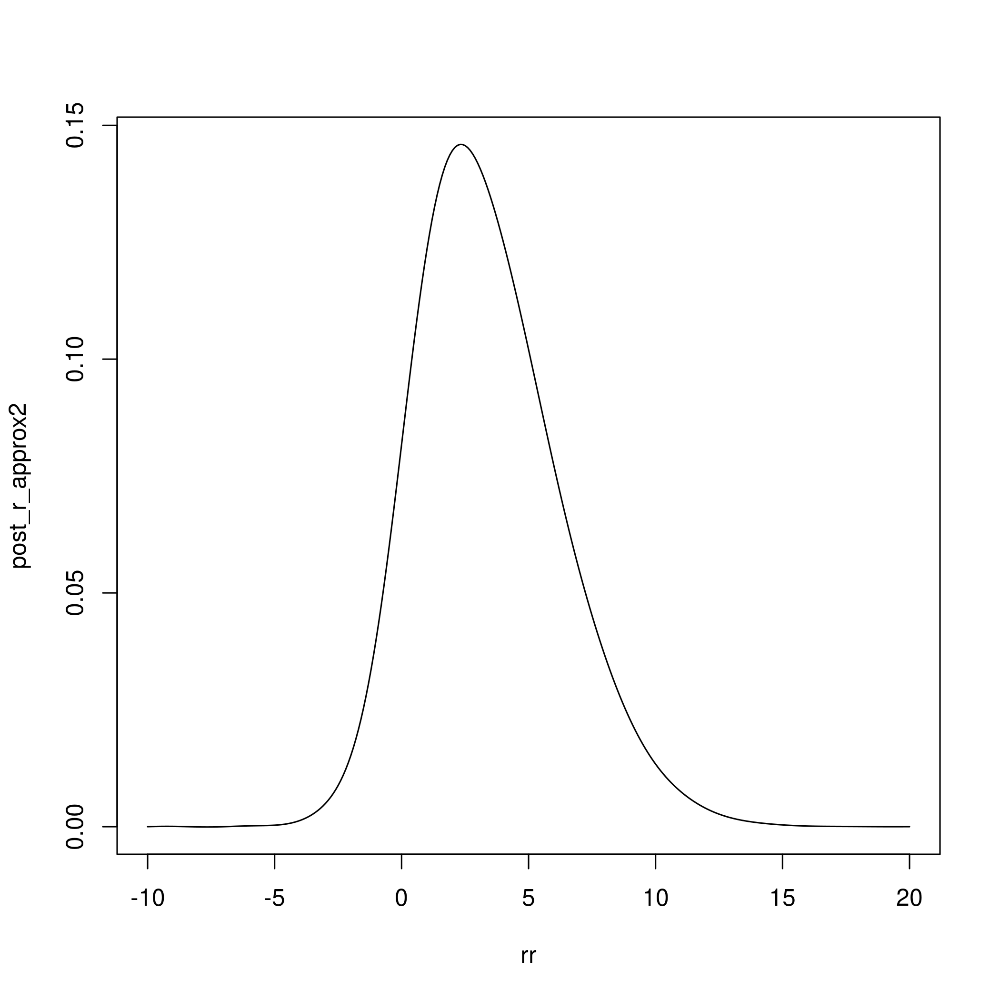

```r
base_name = paste(knitr::current_input(), '_figs/', sep='')
knitr::opts_chunk$set(
  cache.path=paste('_knitr_cache/', base_name, sep='/'),
  fig.path=paste('figure/', base_name, sep='/'),
  dpi=300
)
```


Reproduce Figure 2 of Joseph 2012:

The example used is a Bernoulli - Logit-Normal model:

- $y|r \sim Ber(1/(1+exp(-r)))$
- $r \sim N(\mu, \tau^2)$
- using $y = 1, \mu = 1, \tau = 4$


```r
# log h(r), where h(r) = p(y|r)p(r)
h = function(r, y=1) {
  p = 1/(1+exp(-r))
  llik = sum(dbinom(y, 1, p, log=TRUE))
  lprior = dnorm(r, 1, 4, log=TRUE)
  return(exp(llik + lprior))
}
```


```r
# design points
m = 10
design = data.frame(xx=seq(-10, 20, len=m))
design$hh = sapply(design$xx, h)
```


## the doit approximator for 1-dimensional functions


```r
doit = function(r, design) {

  m = nrow(design)

  GGfun = function(xx, yy, sigma2) {
    drop(exp(-0.5/sigma2 * outer(xx, yy, '-')^2))
  }
  
  # leave-one-out MSE as function of the kernel width
  wmscv = function(sigma2) {
    GG_ = GGfun(design$xx, design$xx, sigma2)
    ee_ = drop(1/diag(solve(GG_)) * solve(GG_) %*% design$hh)
    wmscv = 1/m * drop(ee_ %*% diag(diag(solve(GG_))) %*% ee_)
    return(wmscv)
  }
  
  # minimise wmscv wrt sigma2
  opt = optimize(wmscv, c(1e-6, diff(range(design$xx))))
  sigma2_opt = opt$minimum

  # apply approximation
  GG_ = GGfun(design$xx, design$xx, sigma2_opt)
  cc = solve(GG_, design$hh)

  # approximate target function at input points
  post_r = sapply(r, function(rr) {
    gg = GGfun(rr, design$xx, sigma2_opt)
    phi = gg / sqrt(2*pi*sigma2_opt)
    sum(cc * phi) / sum(cc)
  })
  return(post_r)
}
```


```r
rr = seq(-10, 20, .1)
post_r_approx = doit(rr, design)
plot(rr, post_r_approx, type='l')
```




```r
m2 = 20
design2 = data.frame(xx=seq(-10, 20, len=m2))
design2$hh = sapply(design2$xx, h)
post_r_approx2 = doit(rr, design2)
plot(rr, post_r_approx2, type='l')
```



