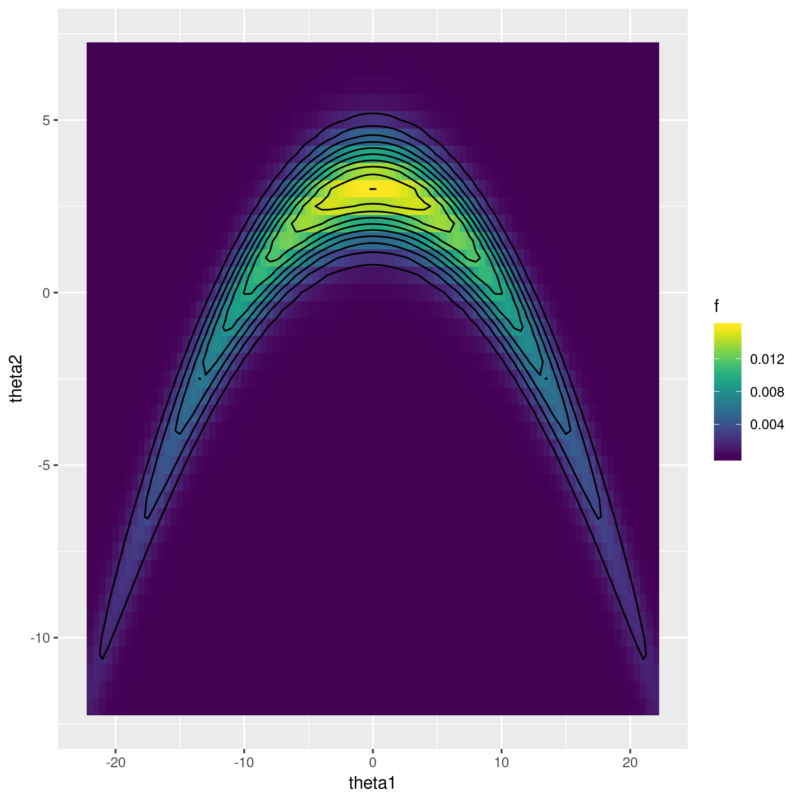
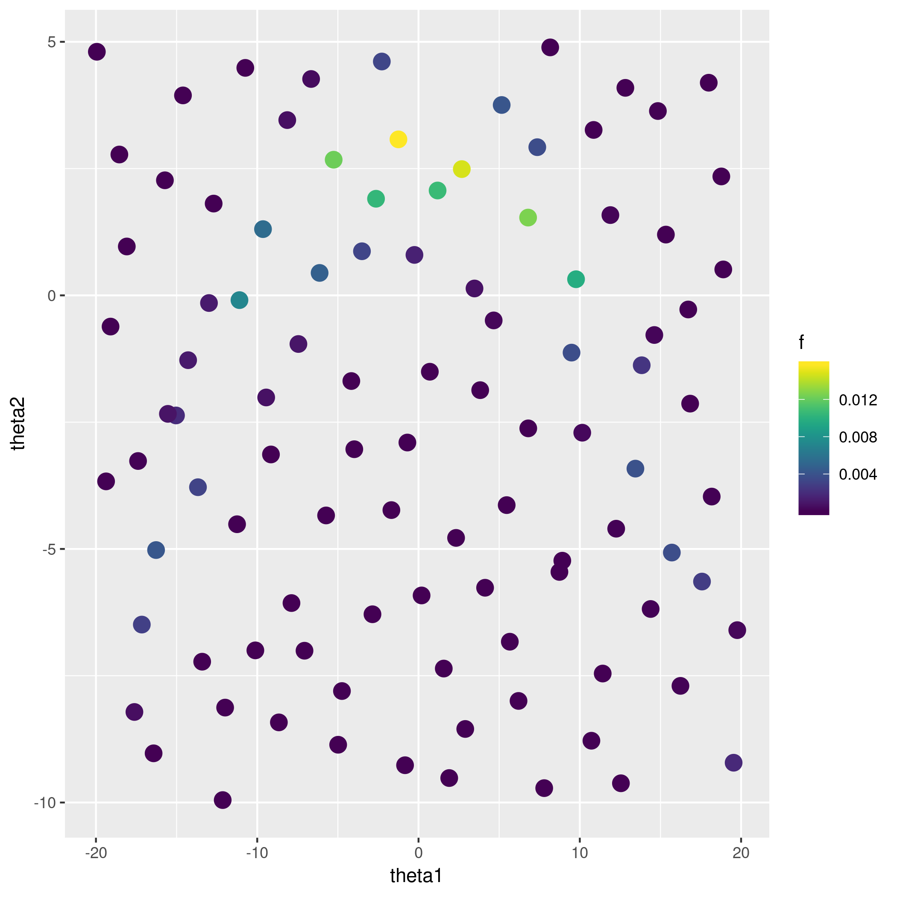
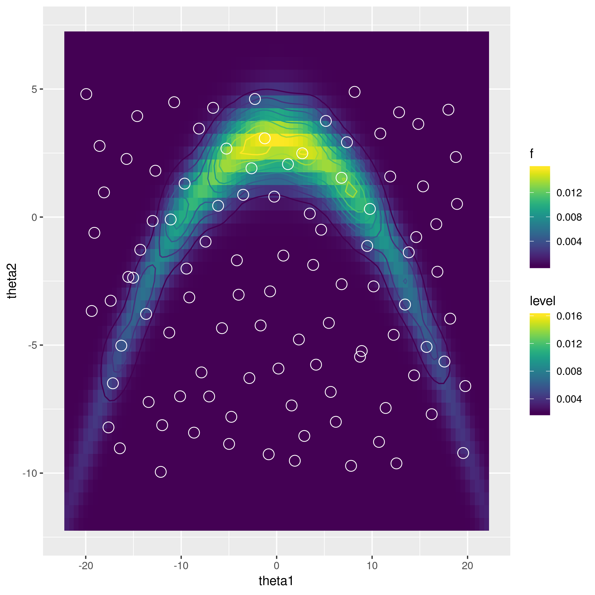
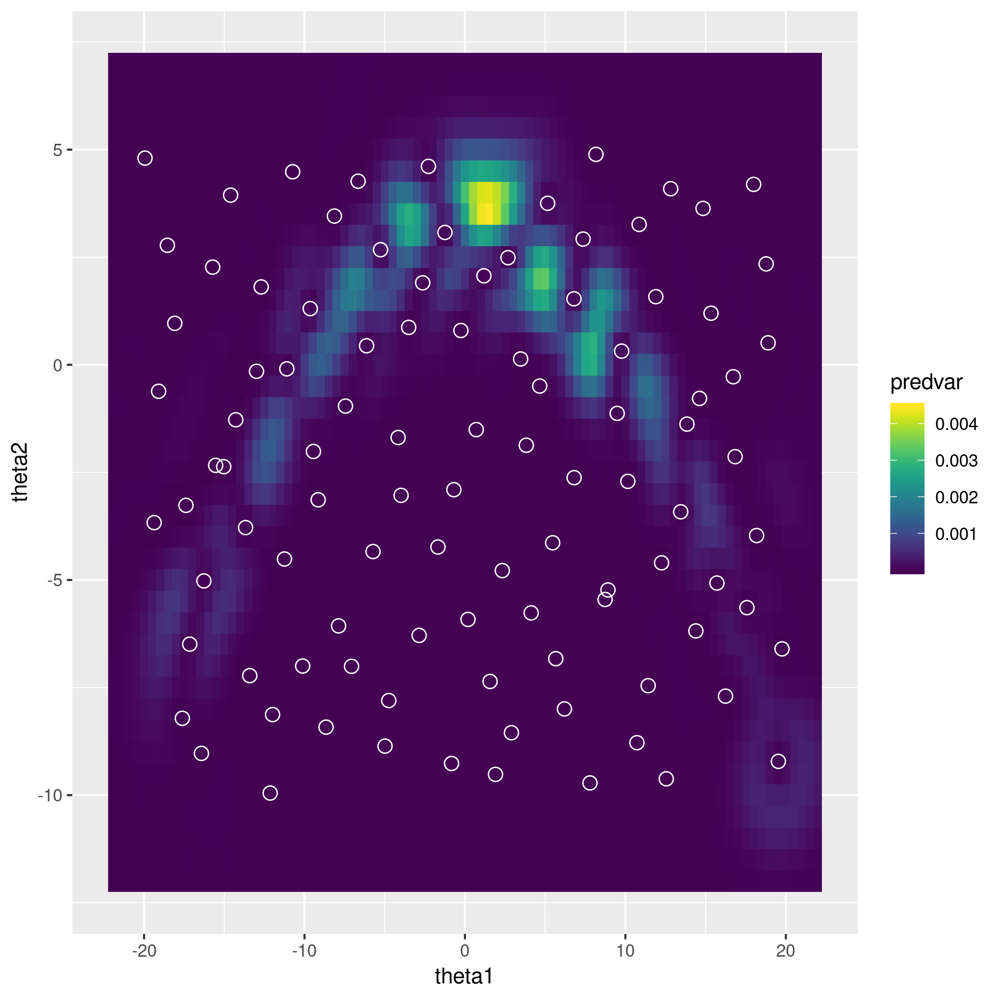
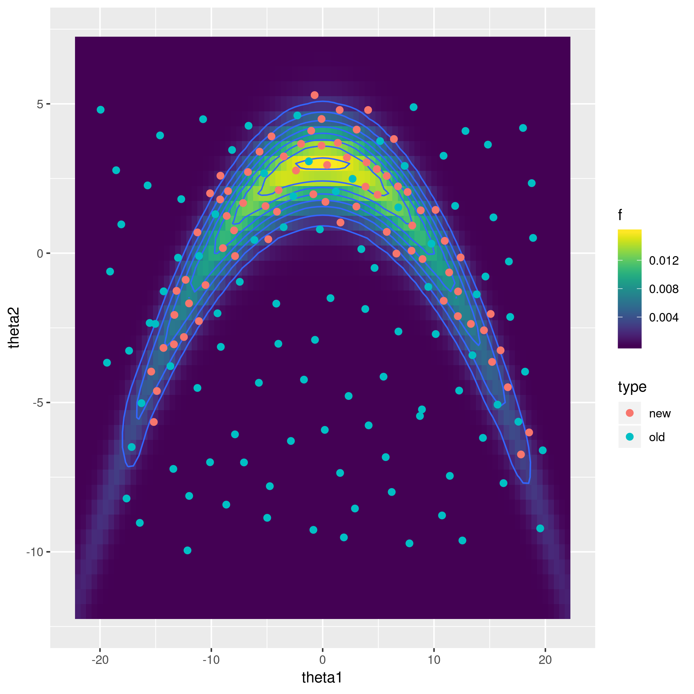
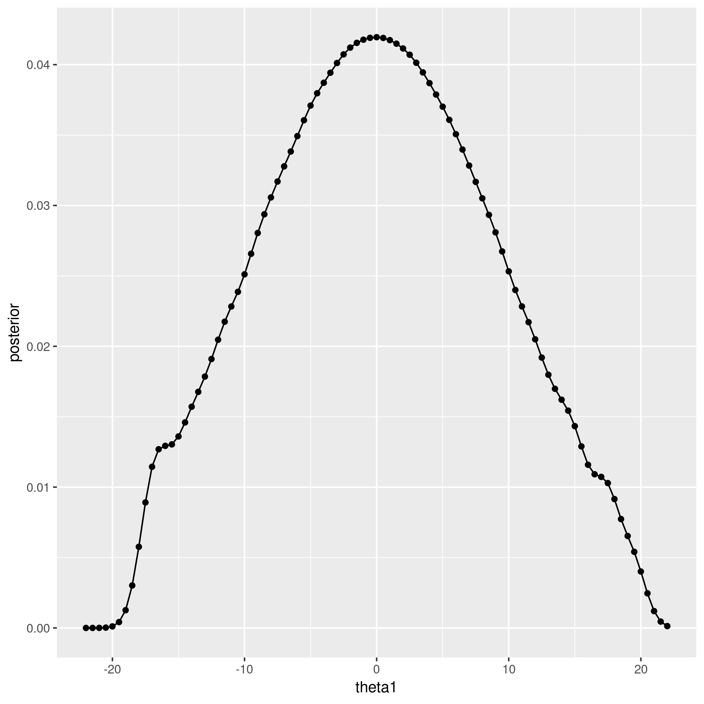
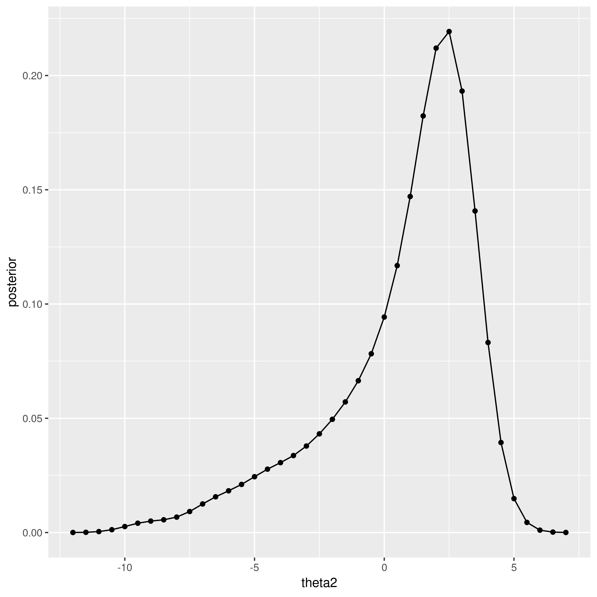

```r
base_name = paste(knitr::current_input(), '_figs/', sep='')
knitr::opts_chunk$set(
  cache.path=paste('_knitr_cache/', base_name, sep='/'),
  fig.path=paste('figure/', base_name, sep='/'),
  dpi=300
)
suppressPackageStartupMessages(library(tidyverse))
suppressPackageStartupMessages(library(mvtnorm))
suppressPackageStartupMessages(library(viridis))
suppressPackageStartupMessages(library(lhs))
```

# The target function


```r
f = function(theta) {
  theta = matrix(theta, ncol=2) 
  x = cbind(theta[,1], theta[,2]+0.03*theta[,1]^2-3)
  dmvnorm(x, c(0,0), diag(c(100, 1)))
}

df = crossing(theta1 = seq(-22, 22, .5), theta2 = seq(-12,7,.5)) %>%
  mutate(f = f(cbind(theta1,theta2)))

ggplot(df) + geom_raster(aes(x=theta1, y=theta2, fill=f)) + geom_contour(aes(x=theta1, y=theta2, z=f), col='black', bins=10) + scale_fill_viridis()
```




# latin hypercube design


```r
set.seed(123)
lhs = maximinLHS(n=100, k=2) %>% 
  as_data_frame %>% 
  setNames(c('theta1', 'theta2')) %>%
  mutate(theta1 = theta1 * 40 - 20, 
         theta2 = theta2 * 15 - 10)
design = lhs %>% mutate(f = f(cbind(theta1, theta2)))
ggplot(design) + geom_point(aes(x=theta1, y=theta2, colour=f), cex=4) + scale_colour_viridis()
```




# doit implementation


```r
doit = function(design, sigma2=NULL) {
  m = nrow(design)
  theta = design %>% select(-f) %>% as.matrix
  ff = design %>% select(f) %>% pull

  GGfun = function(xx, yy, sigma2) {
    drop(exp(-0.5/sigma2[1] * outer(xx[,1], yy[,1], '-')^2 
             -0.5/sigma2[2] * outer(xx[,2], yy[,2], '-')^2))
  }
  
  # leave-one-out MSE as function of the kernel width
  wmscv = function(sigma2) {
    GGinv_ = solve(GGfun(theta, theta, sigma2))
    ee_ = drop(1/diag(GGinv_) * GGinv_ %*% sqrt(ff))
    wmscv = 1/m * drop(ee_ %*% diag(diag(GGinv_)) %*% ee_)
    return(wmscv)
  }
  
  # minimise wmscv wrt sigma2
  if (is.null(sigma2)) {
    opt = optim(c(1,1), wmscv)
    sigma2 = opt$par
  } 

  # apply approximation
  GG = GGfun(theta, theta, sigma2)
  GGinv = solve(GG)
  bb = drop(solve(GG, sqrt(ff)))
  ee = drop(1/diag(GGinv) * GGinv %*% sqrt(ff))

  ans = list(GGfun=GGfun, theta=theta, sigma2=sigma2, 
             ff=ff, bb=bb, GG=GG, GG2=sqrt(GG), ee=ee, GGinv=GGinv)
  class(ans) = 'doit'
  return(ans)
}

approx.doit = function(obj, r) {
  # approximate target function at input points r
  with(obj, {
    bGG2b_ = drop(bb %*% GG2 %*% bb)
    post_r = apply(r, 1, function(rr) {
      gg = GGfun(matrix(rr, nrow=1), theta, sigma2)
      (sum(bb * gg))^2 / (sqrt(pi^2*prod(sigma2)) * bGG2b_)
    })
  return(post_r)
  })
}
```


```r
DOIT = doit(design)
post_r_approx = df %>%
  mutate(fhat = approx.doit(DOIT, cbind(theta1, theta2)))
```


```r
ggplot(post_r_approx, aes(x=theta1, y=theta2)) + geom_raster(aes(fill=f)) + geom_contour(aes(z=fhat, colour=..level..)) + geom_point(data=design, mapping=aes(x=theta1, y=theta2), pch=1, cex=4, colour='white') + scale_colour_viridis() + scale_fill_viridis()
```




# map conditional predictive variance


```r
pv_df = 
df %>% select(theta1, theta2) %>% mutate(predvar = 
  sapply(1:n(), function(ii) {
    theta_ = c(theta1[ii], theta2[ii])
    gg_ = with(DOIT, GGfun(matrix(theta_, nrow=1), theta, sigma2))
    return(with(DOIT, drop(sum(bb*gg_)^2*(1-gg_ %*% GGinv  %*% gg_))))
  }))

ggplot(pv_df) + 
  geom_raster(aes(x=theta1, y=theta2, fill=predvar)) + 
  scale_fill_viridis() +
  geom_point(data=design, aes(x=theta1, y=theta2), pch=1, cex=3, col='white')
```




# sequentially add more points 

... at locations with maximum predictive variance. Since the predictive variance surface is multimodal, the starting point matters. We use the design point with highest leave-one-out predictive variance as the starting point.


```r
propose_new = function(obj) with(obj, {
  fn = function(r) {
    gg = GGfun(matrix(r, nrow=1), theta, sigma2)
    sum(bb * gg)^2 * drop(1 - gg %*% GGinv %*% gg)
  }
  vv = diag(1/diag(GGinv)) %*% (sqrt(ff) - ee)^2
  optim(theta[which.max(vv), ], fn, control=list(fnscale=-1))$par
})
```


```r
theta_n = propose_new(DOIT)
ggplot(pv_df) + 
  geom_raster(aes(x=theta1, y=theta2, fill=predvar)) + 
  scale_fill_viridis() +
  geom_point(data=design, aes(x=theta1, y=theta2), pch=1, cex=3, col='white') +
  geom_point(data=as.data.frame(as.list(theta_n)), aes(x=theta1, y=theta2), pch=1, cex=3, col='red')
```


Add 75 points sequentially (only re-estimating `sigma2` on the last iteration):


```r
n_new = 75
design_update = design
DOIT_update = DOIT
for (jj in 1:n_new) {
  theta_n = propose_new(DOIT_update)
  design_update = bind_rows(
    design_update,
    data_frame(theta1 = theta_n['theta1'], 
               theta2 = theta_n['theta2'],
               f = f(theta_n)))
  if (jj %% 10 == 0) {
    sigma2_ =  NULL
  } else { 
    sigma2_ = DOIT_update$sigma2
  }
  DOIT_update = doit(design_update, sigma2=sigma2_)
}
```


```r
post_r_approx_update = df %>% as_data_frame %>%
  mutate(fhat = approx.doit(DOIT_update, cbind(theta1, theta2)))
ggplot(post_r_approx_update, aes(x=theta1, y=theta2)) + 
  geom_raster(aes(fill=f)) + 
  geom_contour(aes(z=fhat)) + 
  geom_point(data=design_update %>% mutate(type=rep(c('old','new'), c(100, n()-100))), mapping=aes(x=theta1, y=theta2, colour=type), cex=2) + 
  scale_fill_viridis()
```



# Calculate posterior summaries


```r
DOIT2 = DOIT_update
```

## marginal distributions


```r
d_ij = with(DOIT2, tcrossprod(bb) * GG2)
sum_d_ij = sum(d_ij)
nu_ij = map(list(theta1=1, theta2=2), 
            ~with(DOIT2, 0.5 * outer(theta[,.], theta[,.], '+')))
```


```r
theta1_eval = sort(unique(df$theta1))
theta1_design = DOIT2$theta[,1]
sigma1 = DOIT2$sigma2[1]
post_theta1 = sapply(theta1_eval, function(tt) {
  phi_ij = dnorm(tt, nu_ij[[1]], sqrt(sigma1/2))
  sum(d_ij * phi_ij) / sum_d_ij
})
data_frame(theta1 = theta1_eval, posterior = post_theta1) %>%
ggplot(aes(x=theta1, y=posterior)) + geom_point() + geom_line()
```




```r
theta2_eval = sort(unique(df$theta2))
theta2_design = DOIT2$theta[,2]
sigma2 = DOIT2$sigma2[2]
post_theta2 = sapply(theta2_eval, function(tt) {
  phi_ij = dnorm(tt, nu_ij[[2]], sqrt(sigma2/2))
  sum(d_ij * phi_ij) / sum_d_ij
})
data_frame(theta2 = theta2_eval, posterior = post_theta2) %>%
ggplot(aes(x=theta2, y=posterior)) + geom_point() + geom_line()
```



## expectation


```r
e_theta = map_dbl(nu_ij, ~sum(d_ij * .) / sum(d_ij))
print(e_theta)
```

```
##    theta1    theta2 
## 0.2562790 0.7132023
```

## variance


```r
v_theta = matrix(0, 2, 2)
v_theta[1,1] = sum(d_ij * nu_ij[[1]]^2) / sum_d_ij
v_theta[1,2] = v_theta[2,1] = sum(d_ij * nu_ij[[1]] * nu_ij[[2]]) / sum_d_ij
v_theta[2,2] = sum(d_ij * nu_ij[[2]]^2) / sum_d_ij
rownames(v_theta) = colnames(v_theta) = names(e_theta)
v_theta = v_theta + diag(DOIT2$sigma2)/2 - tcrossprod(e_theta)
print(v_theta)
```

```
##           theta1    theta2
## theta1 75.983639 -2.383839
## theta2 -2.383839  8.092616
```


