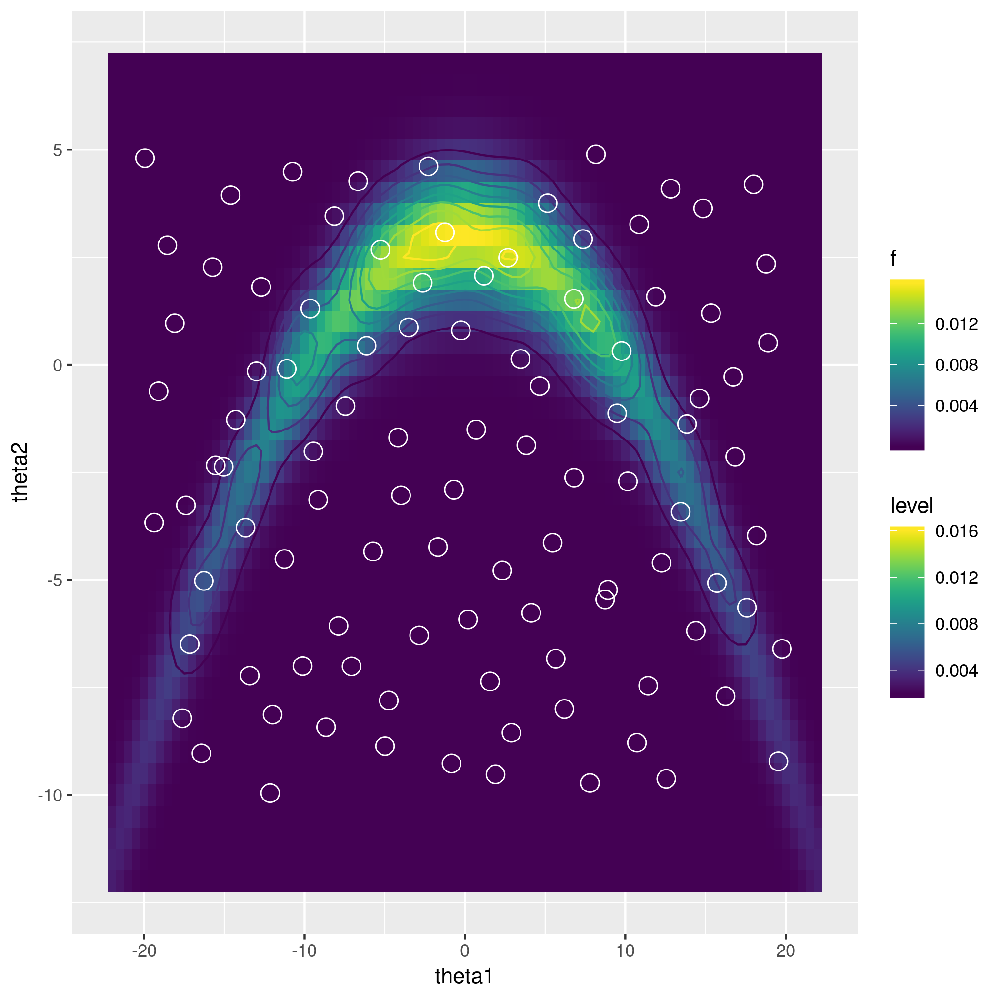
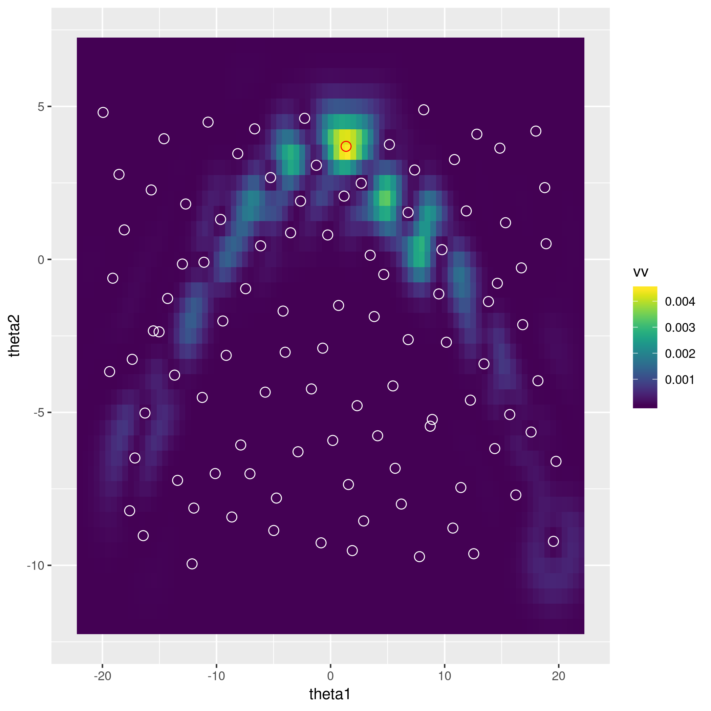
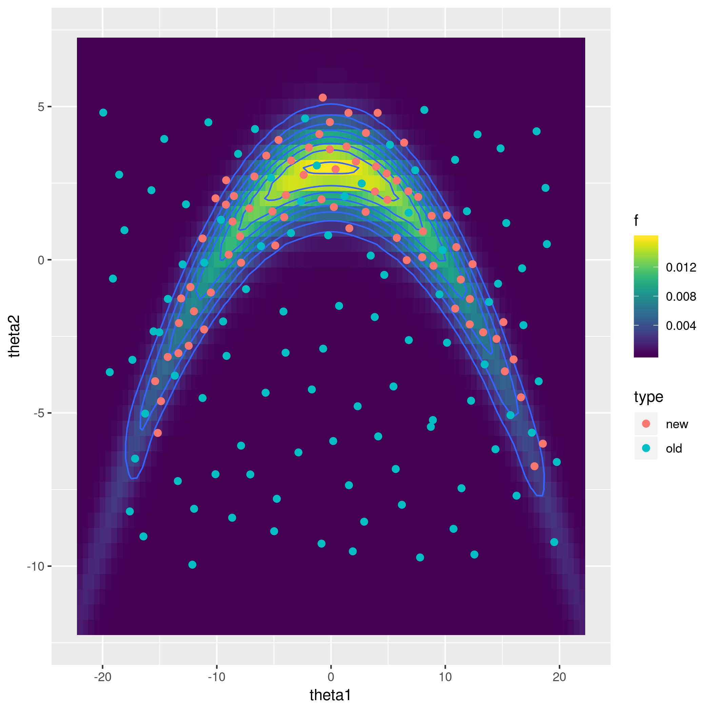

```r
base_name = paste(knitr::current_input(), '_figs/', sep='')
knitr::opts_chunk$set(
  cache.path=paste('_knitr_cache/', base_name, sep='/'),
  fig.path=paste('figure/', base_name, sep='/'),
  dpi=300
)
suppressPackageStartupMessages(library(tidyverse))
suppressPackageStartupMessages(library(mvtnorm))
suppressPackageStartupMessages(library(viridis))
suppressPackageStartupMessages(library(lhs))
```

# The target function


```r
f = function(theta) {
  theta = matrix(theta, ncol=2) 
  x = cbind(theta[,1], theta[,2]+0.03*theta[,1]^2-3)
  dmvnorm(x, c(0,0), diag(c(100, 1)))
}

# true solution
df = crossing(theta1 = seq(-22, 22, .5), theta2 = seq(-12,7,.5)) %>%
  mutate(f = f(cbind(theta1,theta2)))

ggplot(df) + 
  geom_raster(aes(x=theta1, y=theta2, fill=f)) + 
  geom_contour(aes(x=theta1, y=theta2, z=f), col='black', bins=10) + 
  scale_fill_viridis()
```


# latin hypercube design


```r
set.seed(123)
lhs = maximinLHS(n=100, k=2) %>% 
  as_data_frame %>% 
  setNames(c('theta1', 'theta2')) %>%
  mutate(theta1 = theta1 * 40 - 20, 
         theta2 = theta2 * 15 - 10)
design = lhs %>% mutate(f = f(cbind(theta1, theta2)))
print(design)
```

```
## # A tibble: 100 x 3
##    theta1  theta2        f
##     <dbl>   <dbl>    <dbl>
##  1   8.92 -5.23   4.02e-10
##  2 -15.0  -2.37   1.89e- 3
##  3  17.6  -5.64   2.79e- 3
##  4 -17.4  -3.27   6.87e- 5
##  5  14.6  -0.782  1.71e- 4
##  6   1.18  2.07   1.06e- 2
##  7   3.47  0.136  6.54e- 4
##  8  14.8   3.63   2.15e-14
##  9 -11.1  -0.0937 7.16e- 3
## 10  -7.07 -7.01   2.38e-18
## # ... with 90 more rows
```


# doit implementation


```r
doit_estimate_sigma = function(design, sigma_0=NULL, optim_control=NULL) {
  stopifnot(nrow(design) > 1)
  m = nrow(design)
  theta = design %>% select(-f) %>% as.matrix
  dd = ncol(theta)
  ff = design$f

  GGfun = function(sigma2) {
    mat_ = matrix(0, nrow=m, ncol=m)
    for (ii in seq_len(dd)) {    
      mat_ = mat_ - outer(theta[,ii], theta[,ii], '-')^2 / (2 * sigma2[ii])
    }
    return(drop(exp(mat_)))
  }

  # leave-one-out MSE as function of the kernel width
  wmscv = function(sigma2) {
    GGinv_ = solve(GGfun(sigma2))
    ee_ = drop(1/diag(GGinv_) * GGinv_ %*% sqrt(ff))
    wmscv = sum(ee_ * diag(GGinv_) * ee_) / m
    return(wmscv)
 }

  # minimise wmscv wrt sigma2, use `optimize` for 1d and `optim` for >1d
  if (dd == 1) {
    sigma2 = optimize(wmscv, c(1e-6, diff(range(design$xx))))$minimum
  } else {
    if (is.null(sigma_0)) { # use component-wise silvermans rule as starting point 
      sigma_0 = 1.06 * m^(-.2) * apply(theta, 2, sd)
    }
    sigma2 = optim(sigma_0, wmscv)$par
  }
  return(sigma2)
}
```


```r
doit_fit = function(design, sigma2=NULL) {
  m = nrow(design)
  theta = design %>% select(-f) %>% as.matrix
  dd = ncol(theta)
  ff = design$f

  GGfun = function(xx, yy, sigma2) {
    if (is.null(dim(xx))) xx = matrix(xx, nrow=1)
    if (is.null(dim(yy))) yy = matrix(yy, nrow=1)
    stopifnot(ncol(xx) == ncol(yy), ncol(xx) == length(sigma2))
    mat_ = matrix(0, nrow=nrow(xx), ncol=nrow(yy))
    for (ii in seq_along(sigma2)) {    
      mat_ = mat_ - outer(xx[,ii], yy[,ii], '-')^2 / (2 * sigma2[ii])
    }
    return(drop(exp(mat_)))
  }
  
  if(is.null(sigma2)) {
    sigma2 = doit_estimate_sigma(design)
  }

  # calculate parameters
  GG = GGfun(theta, theta, sigma2)
  GGinv = solve(GG)
  bb = drop(solve(GG, sqrt(ff)))
  ee = drop(1/diag(GGinv) * GGinv %*% sqrt(ff))

  ans = list(GGfun=GGfun, theta=theta, sigma2=sigma2, 
             ff=ff, bb=bb, GG=GG, GG2=sqrt(GG), ee=ee, GGinv=GGinv)
  return(ans)
}
```


```r
doit_approx = function(doit, theta_eval) {
  # calculate expecation and variance of target function at matrix of input
  # points r
  with(doit, {
    bGG2b_ = drop(bb %*% GG2 %*% bb)
    gg_ = GGfun(theta_eval, theta, sigma2)
    ggbb2_ = drop(gg_ %*% bb)^2
    ee_ = ggbb2_ / (sqrt(prod(pi*sigma2)) * bGG2b_)
    vv_ = ggbb2_ * drop(1 - rowSums(gg_ * (gg_ %*% GGinv)))
    return(as_data_frame(cbind(theta_eval, ee=ee_, vv=vv_)))
  })
}
```


```r
doit = doit_fit(design)
theta_eval = select(df, starts_with('theta')) %>% as.matrix
doit_eval = doit_approx(doit, theta_eval) %>% as_data_frame
```


```r
ggplot(mapping=aes(x=theta1, y=theta2)) + 
  geom_raster(data=df, aes(fill=f)) + 
  geom_contour(data=doit_eval, aes(z=ee, colour=..level..)) + 
  geom_point(data=design, pch=1, cex=4, colour='white') + 
  scale_colour_viridis() + scale_fill_viridis()
```




# map conditional predictive variance


```r
ggplot(data=doit_eval, mapping=aes(x=theta1, y=theta2)) + 
  geom_raster(aes(fill=vv)) + 
  geom_contour(aes(z=ee, colour=..level..)) + 
  geom_point(data=design, pch=1, cex=4, colour='white') + 
  scale_colour_viridis() + scale_fill_viridis()
```


# sequentially add more points 

... at locations with the maximum predictive variance. Since the predictive variance surface is multimodal, the starting point used in the numerical maximisation matters. We use the design point with highest leave-one-out predictive variance as the starting point.


```r
propose_new = function(doit) with(doit, {
  fn = function(r) {
    gg = GGfun(r, theta, sigma2)
    sum(bb * gg)^2 * drop(1 - gg %*% GGinv %*% gg)
  }
  vv =  (sqrt(ff) - ee)^2 / diag(GGinv)
  r0 = theta[which.max(vv), ]
  optim(r0, fn, control=list(fnscale=-1))$par
})
```


```r
theta_n = propose_new(doit)
ggplot(doit_eval, aes(x=theta1, y=theta2)) + 
  geom_raster(aes(fill=vv)) + 
  scale_fill_viridis() +
  geom_point(data=design, pch=1, cex=3, col='white') +
  geom_point(data=data.frame(as.list(theta_n)), pch=1, cex=3, col='red')
```




Add 75 points sequentially (only re-estimating `sigma2` on the last iteration):


```r
# function to update the doit object quickly if the smoothing parameters sigma2
# don't change; otherwise, call doit_fit again
doit_update = function(doit, design_new) with(doit, {
  design_new = design_new[1, ] 
  theta_new  = design_new %>% select(-f) %>% as.matrix
  theta_up   = rbind(theta, theta_new)
  gg_        = GGfun(theta, theta_new, sigma2)
  gg2_       = sqrt(gg_)
  GG_up      = rbind(cbind(GG, gg_), cbind(t(gg_), 1))
  GG2_up     = rbind(cbind(GG2, gg2_), cbind(t(gg2_), 1))
  dd_        = 1 / drop(1 - crossprod(gg_, GGinv %*% gg_))
  hh_        = GGinv %*% gg_
  GGinv_up   = rbind(cbind(GGinv + dd_*tcrossprod(hh_), - dd_*hh_),
                     cbind(-dd_ * t(hh_), dd_))
  ff_up = c(ff, design_new$f)
  bb_up = drop(GGinv_up %*% sqrt(ff_up))
  ee_up = drop(1/diag(GGinv_up) * GGinv_up %*% sqrt(ff_up))
  # write new object
  doit$theta = theta_up
  doit$ff    = ff_up
  doit$bb    = bb_up
  doit$GG    = GG_up
  doit$GG2   = GG2_up
  doit$ee    = ee_up
  doit$GGinv = GGinv_up
  return(doit)
})
```


```r
n_new = 75
design_new = design
doit_new = doit
for (jj in 1:n_new) {
  theta_n    = propose_new(doit_new)
  f_n        = f(theta_n)
  design_add = data.frame(as.list(theta_n), f=f_n)
  design_new = bind_rows(design_new, design_add)
  if (jj %% 10 == 0) {
    sigma2 = doit_estimate_sigma(design_new)
    doit_new = doit_fit(design_new, sigma2=sigma2)
  } else { 
    doit_new = doit_update(doit_new, design_add)
  }
}
```


```r
doit_eval_update = doit_approx(doit_new, theta_eval)
ggplot(mapping=aes(x=theta1, y=theta2)) + 
  geom_raster(data=df, aes(fill=f)) + 
  geom_contour(data=doit_eval_update, aes(z=ee)) + 
  geom_point(data=design_new %>% 
                  mutate(type=rep(c('old','new'), c(100, n()-100))), 
             mapping=aes(x=theta1, y=theta2, colour=type), cex=2) + 
  scale_fill_viridis()
```



# Calculate posterior summaries


```r
doit2 = doit_new
```


## marginal distributions


```r
doit_marginal = function(doit, k, theta_eval=NULL) with(doit, {
  if (is.null(theta_eval)) theta_eval = theta[, k]
  d_ij = tcrossprod(bb) * GG2
  sum_d_ij = sum(d_ij)
  nu_ij = 0.5 * outer(theta[,k], theta[,k], '+')
  sd_ = sqrt(sigma2[k]/2)
  ans = sapply(theta_eval, function(tt) {
    phi_ij = dnorm(tt, nu_ij, sd_)
    return(sum(d_ij * phi_ij) / sum_d_ij)
  })
  return(data_frame(par=colnames(theta)[k], theta=theta_eval, posterior=ans))
})
doit_marginals = function(doit, theta_eval=NULL) {
  map_df(1:ncol(doit$theta), ~doit_marginal(doit, ., theta_eval))
}
```


```r
marg_theta = doit_marginals(doit2)
ggplot(marg_theta, aes(x=theta, y=posterior)) + geom_point() + geom_line() + facet_wrap(~par, scales='free')
```


## expectation


```r
doit_expectation = function(doit) with(doit, {
  d_ij = tcrossprod(bb) * GG2
  sum_d_ij = sum(d_ij)
  nu_ij = map(colnames(theta), ~0.5 * outer(theta[,.], theta[,.], '+'))
  return(map_dbl(nu_ij, ~sum(d_ij * .) / sum(d_ij)))
})
doit_expectation(doit2)
```

```
## [1] 0.2563204 0.7132047
```


## variance


```r
doit_variance = function(doit) with(doit, {
  d_ij = tcrossprod(bb) * GG2
  sum_d_ij = sum(d_ij)
  nu_ij = map(colnames(theta), ~0.5 * outer(theta[,.], theta[,.], '+'))
  dd = ncol(theta)
  kk = expand.grid(ii = 1:dd, jj = 1:dd) %>% filter(jj >= ii) %>%
       mutate(v = map2_dbl(ii, jj, ~ sum(d_ij * nu_ij[[.x]] * nu_ij[[.y]]) / sum_d_ij))
  v_theta = matrix(0, dd, dd)
  for (l in 1:nrow(kk)) {
    v_theta[kk[l,'ii'], kk[l,'jj']] = v_theta[kk[l,'jj'], kk[l,'ii']] = kk[l,'v']
  }
  rownames(v_theta) = colnames(v_theta) = colnames(theta)
  return(v_theta)
})
v_theta = doit_variance(doit2)  
print(v_theta)
```

```
##           theta1    theta2
## theta1 75.146417 -2.201336
## theta2 -2.201336  7.895980
```


