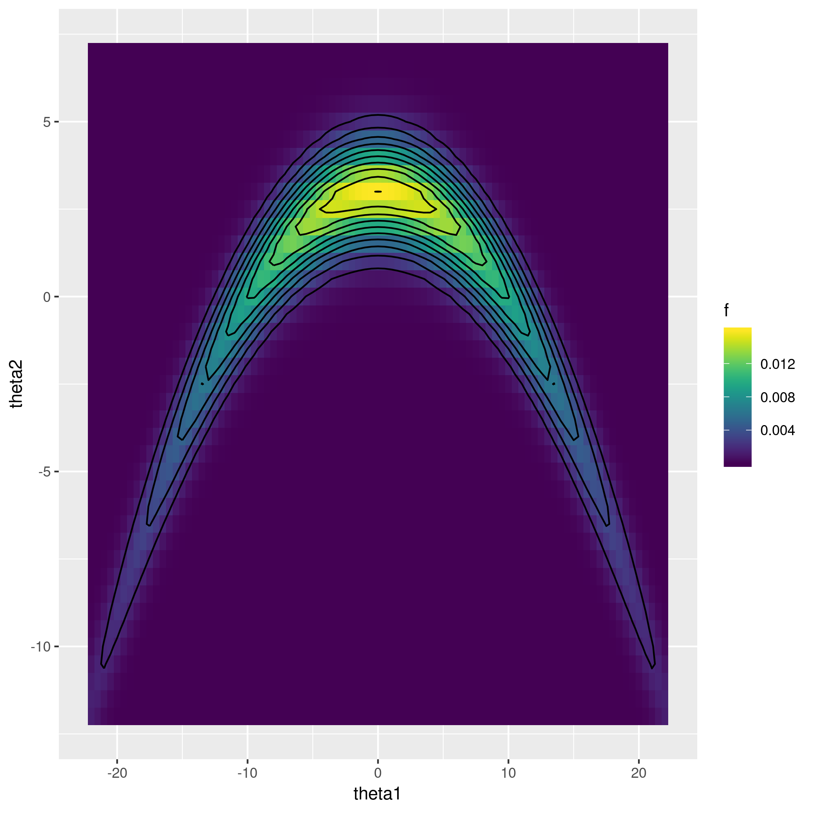

```r
base_name = paste(knitr::current_input(), '_figs/', sep='')
knitr::opts_chunk$set(
  cache.path=paste('_knitr_cache/', base_name, sep='/'),
  fig.path=paste('figure/', base_name, sep='/'),
  dpi=300
)
suppressPackageStartupMessages(library(tidyverse))
suppressPackageStartupMessages(library(mvtnorm))
suppressPackageStartupMessages(library(viridis))
suppressPackageStartupMessages(library(lhs))
```

# The target function


```r
f = function(theta) {
  theta = matrix(theta, ncol=2) 
  x = cbind(theta[,1], theta[,2]+0.03*theta[,1]^2-3)
  dmvnorm(x, c(0,0), diag(c(100, 1)))
}

df = crossing(theta1 = seq(-22, 22, .5), theta2 = seq(-12,7,.5)) %>%
  mutate(f = f(cbind(theta1,theta2)))

ggplot(df) + geom_raster(aes(x=theta1, y=theta2, fill=f)) + geom_contour(aes(x=theta1, y=theta2, z=f), col='black', bins=10) + scale_fill_viridis()
```




# latin hypercube design


```r
set.seed(123)
lhs = maximinLHS(n=100, k=2) %>% 
  as_data_frame %>% 
  setNames(c('theta1', 'theta2')) %>%
  mutate(theta1 = theta1 * 40 - 20, 
         theta2 = theta2 * 15 - 10)
design = lhs %>% mutate(f = f(cbind(theta1, theta2)))
ggplot(design) + geom_point(aes(x=theta1, y=theta2, colour=f), cex=4) + scale_colour_viridis()
```


# doit implementation


```r
doit = function(r, design) {
  m = nrow(design)
  theta = design %>% select(-f) %>% as.matrix
  ff = design %>% select(f) %>% pull

  GGfun = function(xx, yy, sigma2) {
    drop(exp(-0.5/sigma2[1] * outer(xx[,1], yy[,1], '-')^2 
             -0.5/sigma2[2] * outer(xx[,2], yy[,2], '-')^2))

  }
  
  # leave-one-out MSE as function of the kernel width
  wmscv = function(sigma2) {
    GG_ = GGfun(theta, theta, sigma2)
    GGinv_ = solve(GG_)
    ee_ = drop(1/diag(GGinv_) * GGinv_ %*% sqrt(ff))
    wmscv = 1/m * drop(ee_ %*% diag(diag(GGinv_)) %*% ee_)
    return(wmscv)
  }
  
  # minimise wmscv wrt sigma2
  opt = optim(c(1,1), wmscv)
  sigma2_opt = opt$par

  # apply approximation
  GG_ = GGfun(theta, theta, sigma2_opt)
  bb = drop(solve(GG_, sqrt(ff)))

  # approximate target function at input points
  bGG2b_ = drop(bb %*% GGfun(theta, theta, 2*sigma2_opt) %*% bb)
  post_r = apply(r, 1, function(rr) {
    gg = GGfun(matrix(rr, nrow=1), theta, sigma2_opt)
    (sum(bb * gg))^2 / (sqrt(pi^2*prod(sigma2_opt)) * bGG2b_)
  })
  
  return(post_r)
}
```


```r
post_r_approx = df %>%
  mutate(fhat = doit(cbind(theta1, theta2), design))
```


```r
ggplot(post_r_approx, aes(x=theta1, y=theta2)) + geom_raster(aes(fill=f)) + geom_contour(aes(z=fhat, colour=..level..)) + geom_point(data=design, mapping=aes(x=theta1, y=theta2), pch=1, cex=4, colour='white') + scale_colour_viridis() + scale_fill_viridis()
```


